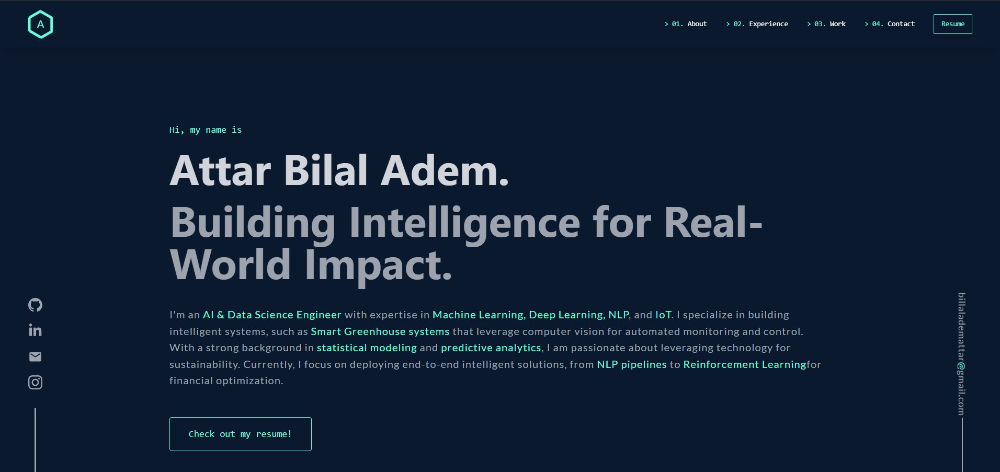

# 👨‍💻 Attar Bilal Adem | Portfolio Website v1.0



> **"Building Intelligence for Real-World Impact."**

This repository contains the source code for my personal portfolio website. Built with **Next.js**, **TypeScript**, and **Tailwind CSS**, it serves as a central hub to showcase my projects in AI, Data Science, and Full Stack Engineering.

[](https://nextjs.org/)
[](https://www.typescriptlang.org/)
[](https://tailwindcss.com/)
[](https://www.framer.com/motion/)

## 🚀 Overview

This portfolio is designed to be performant, responsive, and visually engaging. It features a custom dark mode theme (`bg-AAprimary`), smooth animations, and a structured showcase of my academic and professional journey.

### ✨ Key Features

* **Responsive Design:** Fully adaptive UI for Desktop, Tablet, and Mobile devices with a custom screen size detector.
* **Smooth Animations:** extensive use of **Framer Motion** for component transitions and **AOS** (Animate On Scroll) for scroll-triggered effects.
* **Security & Logic:** Integrated IP-based location detection to handle region-specific logic (e.g., Blacklisting functionality via `ipify` API).
* **Context Management:** Utilizes React Context API for global state management (loading states, user data).
* **SEO Optimized:** configured `Head` metadata for optimal social sharing and search visibility.

## 🛠️ Tech Stack

* **Framework:** [Next.js](https://nextjs.org/)
* **Language:** [TypeScript](https://www.typescriptlang.org/)
* **Styling:** [Tailwind CSS](https://tailwindcss.com/)
* **Animations:** [Framer Motion](https://www.framer.com/motion/) & [AOS](https://michalsnik.github.io/aos/)
* **Icons:** Custom SVG Components
* **Deployment:** Vercel / GitHub Pages

## 📂 Portfolio Sections

The website is divided into several logical components:

1. **Hero Section:** Animated introduction and resume download.
2. **About Me:** Bio, skills matrix, and personal background.
3. **Experience:** Tabbed interface detailing my work at:
   * *BI Engineering Tech*
   * *National Bank of Algeria (BNA)*
   * *The Sparks Foundation*
4. **Projects:** Deep dive into my technical projects (AI, IoT, Web):
   * **Smart Greenhouse AI System:** IoT & YOLO-based monitoring.
   * **RL Portfolio Optimization:** PPO/DDPG algorithms for Finance.
   * **CarHub Marketplace:** Full-stack Next.js rental platform.
   * **Medical QA LLM:** Fine-tuned DistilBERT for medical queries.
   * **Video Recognition:** Multiclass action recognition using EfficientNet.
   * **Stock Prediction:** Hybrid forecasting with Sentiment Analysis.

## ⚙️ Installation & Setup

To run this project locally on your machine:

1. **Clone the repository**

   ```bash
   git clone [https://github.com/BilalAdem/my-website.git](https://github.com/BilalAdem/my-website.git)
   cd my-website
   ```
2. **Install Dependencies**

   ```bash
   npm install
   # or
   yarn install
   ```
3. **Configure Environment Variables**
   Create a `.env.local` file in the root directory and add the following:

   ```env
   NEXT_PUBLIC_BLACKLIST_COUNTRIES="List_Of_Countries_Codes"
   ```

   *(Note: Leave empty if you do not wish to block any regions)*
4. **Run the Development Server**

   ```bash
   npm run dev
   ```
5. **Open in Browser**
   Navigate to `http://localhost:3000` to see the application.

## 📬 Contact

I am currently open to roles in **AI Engineering**, **Data Science**, and **Machine Learning**.

* **Email:** [billalademattar@gmail.com](mailto:billalademattar@gmail.com)
* **LinkedIn:** [Attar Bilal Adem](https://www.linkedin.com/in/bilaladem/)
* **GitHub:** [BilalAdem](https://github.com/BilalAdem)
* **Instagram:** [@bilalademattar](https://www.instagram.com/bilalademattar/)

---

*Designed and Built by Attar Bilal Adem.*
